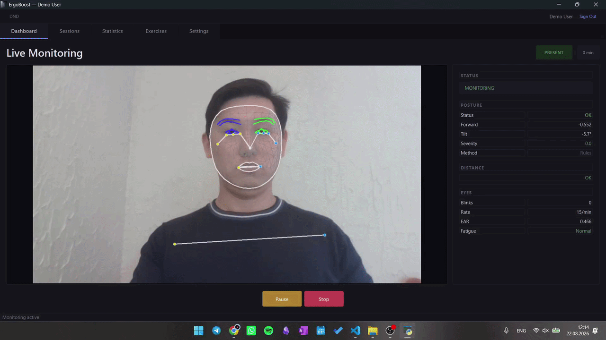
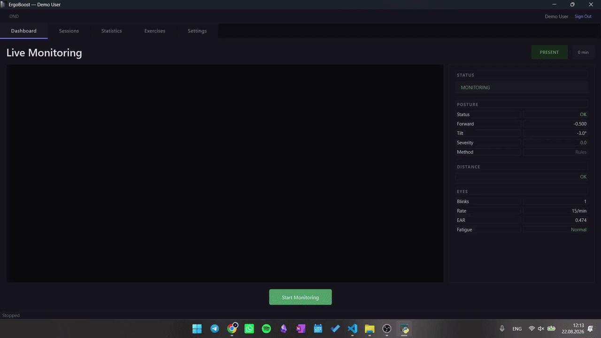
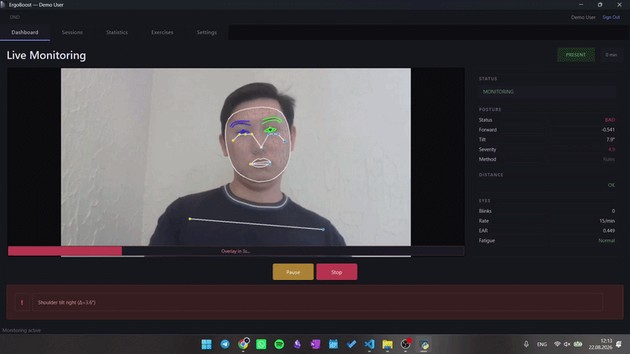
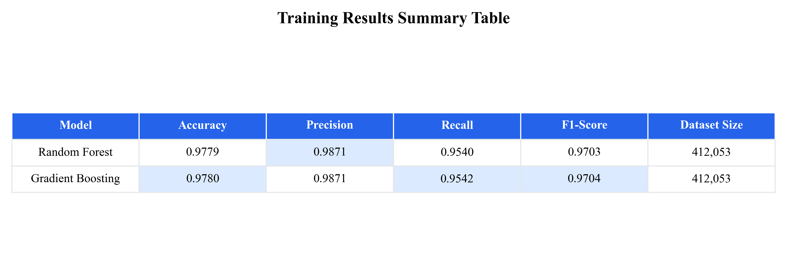

<div align="center">

# 🪑 ErgoBoost

**A real-time ergonomics coach that watches your posture, eyes, and screen distance through your webcam — and gets smarter the more you use it.**

[](https://www.python.org/)
[-41CD52?logo=qt&logoColor=white)](https://doc.qt.io/qtforpython/)
[](https://developers.google.com/mediapipe)
[](https://scikit-learn.org/)
[](https://spark.apache.org/)
[](LICENSE)

**[🇬🇧 English](README.md) | [🇷🇺 Читать на русском](README.ru.md)**



</div>

## What is this?

**ErgoBoost** is a Windows desktop app that sits in your system tray and continuously analyzes your webcam feed to catch bad ergonomic habits before they become pain: slouching, leaning too close to the screen, and not blinking enough. It's not just a set of hardcoded rules — it trains a real classifier on *your* posture data in the background and hot-swaps it in without ever interrupting the camera loop.

It was built as a Computer Science diploma project, but it's a fully working, installable application — not a notebook or a proof of concept. The full methodology is written up in [`docs/diploma_paper.pdf`](docs/diploma_paper.pdf).

## 📸 In Action

| Calibration | Forward-shift (slouch) detection | Lateral tilt detection |
|:---:|:---:|:---:|
|  |  |  |
| One-time baseline setup — sit straight for a few seconds so ErgoBoost learns *your* neutral posture | Head/shoulders drift forward → live status flips to BAD → countdown → screen overlay warning | Shoulder line tilts sideways → caught the same way, independently of forward shift |

## ✨ Features

- **Real-time posture tracking** — forward head shift and shoulder tilt, computed from MediaPipe `PoseLandmarker` keypoints and smoothed with a moving-average buffer to kill jitter.
- **Eye fatigue detection** — Eye Aspect Ratio (EAR) blink detection via `FaceLandmarker`, with a rolling blink-rate-per-minute fatigue score.
- **Screen distance monitoring** — flags "too close" / "too far" based on relative face width against a personal calibration baseline.
- **One-time personal calibration** — a short calibration step establishes *your* neutral posture as the baseline, so deviations are relative to you, not a generic average.
- **ML posture classifier with online learning** — a `GradientBoostingClassifier` / `RandomForestClassifier` scores posture as OK/BAD, and periodically retrains itself on your latest session data in a background thread. A new model only replaces the live one if it beats an F1 threshold — hot-swapped in memory, zero downtime.
- **Leak-free evaluation** — cross-validation uses `GroupKFold` grouped by `session_id`, so the model is never validated on frames from the same session it trained on.
- **Screen-blur overlay** — if bad posture persists past a short grace period, the screen dims across every monitor until you sit up straight (or hit Escape).
- **Break reminders** — soft/hard limits on continuous work time, with absence detection to pause the timer when you actually step away.
- **Local auth + session history** — PBKDF2-SHA256 hashed accounts, SQLite-backed session log, trend charts, and one-click PDF session reports.
- **Big-data analytics pipeline** — a parallel PySpark pipeline (`ml/train_pyspark.py`, `analytics/pyspark_analytics.py`) for training and analyzing at a scale a single-machine pandas pipeline wouldn't handle.

## 🛠 Tech Stack

| Layer | Technology |
|---|---|
| GUI | [PySide6](https://doc.qt.io/qtforpython/) (Qt for Python), custom dark theme via QSS |
| Computer Vision | [OpenCV](https://opencv.org/) (capture) + [MediaPipe Tasks API](https://developers.google.com/mediapipe) (`PoseLandmarker`, `FaceLandmarker`) |
| Machine Learning | [scikit-learn](https://scikit-learn.org/) (GradientBoosting / RandomForest, `GroupKFold`), `pandas`, `numpy` |
| Big Data | [PySpark](https://spark.apache.org/docs/latest/api/python/) via JDBC into SQLite |
| Storage | SQLite3 (repository pattern in `data/sqlite_repo.py`) |
| Reporting | `matplotlib` (in-memory charts → `QPixmap`), `seaborn`, PDF export via `matplotlib.backends.backend_pdf` |
| Packaging | PyInstaller (`ErgoBoost.spec`) |

## 🏗 Architecture

```
Presentation (PySide6 GUI)  →  runs the QThread MonitoringWorker
        │
Services (CV + business logic)  →  PoseDetector, BlinkDetector, DistanceDetector,
        │                          BaselineCalibrator, BreakReminder, AlertManager
        ▼
Data Access (SQLite repository)  →  sessions, posture/eye/distance/presence events
        │
ML Pipeline  →  Predictor (inference) + OnlineTrainer (background retraining) + PySpark (batch/big data)
```

The GUI never blocks: all camera and CV work runs in a dedicated `QThread` (`MonitoringWorker`), communicating with the UI purely through Qt signals/slots. Full write-up of every module and formula (posture score, EAR, forward-shift math, etc.) is in [`architecture.md`](architecture.md).

## 🚀 Getting Started

**Requirements:** Windows, Python 3.10+, a webcam.

```bash
git clone https://github.com/SHOKinator/ErgoBoost-App.git
cd ErgoBoost-App

python -m venv .venv
.venv\Scripts\activate

pip install -r requirements.txt

python ergoboost_app.py
```

That's it — the MediaPipe pose/face models and the pretrained posture classifier already ship inside `models/` and `ml/models/`, so there's nothing extra to download. On first launch you'll create a local account (stored only in your local SQLite DB) and run a short posture calibration.

<details>
<summary>Optional: PySpark big-data pipeline</summary>

The PySpark pieces (`pyspark` package + a `sqlite-jdbc` driver in `libs/`) are optional and only needed if you want to run the distributed training/analytics scripts under `ml/train_pyspark.py` and `analytics/pyspark_analytics.py`. They're commented out in `requirements.txt` by default.
</details>

## 📁 Project Structure

```
ergoboost/
├── ergoboost_app.py     # Entry point
├── gui/                 # PySide6 windows, tabs, the monitoring worker thread
├── services/             # CV detectors + business logic (pose, blink, distance, calibration, alerts, auth)
├── ml/                   # Inference, online training, PySpark training pipeline, model weights
├── analytics/             # Summary + PySpark-based analytics
├── data/                  # SQLite repository, schema, local DB (git-ignored)
├── utils/                 # Charting, PDF reports, logging, CSV export
├── test/ & tools/          # Dataset collection, model evaluation, synthetic data generation
├── docs/                  # Per-module architecture docs + the diploma paper
└── models/                # Pretrained MediaPipe pose/face landmark models
```

## 📊 Model Performance

The classifier is evaluated with grouped cross-validation to avoid session leakage; full metrics, confusion matrices, and feature-importance charts are generated by `test/evaluate_model.py` and `ml/generate_diploma_charts.py`:



More charts (confusion matrices, ROC curves, feature importance, cross-validation results) live in [`ml/diploma_charts/`](ml/diploma_charts/) and [`test/results/`](test/results/).

## 📄 Diploma Paper

The full methodology, formulas, and evaluation are written up in [`docs/diploma_paper.pdf`](docs/diploma_paper.pdf).

## ⚠️ Known Limitations

- Native toast notifications (`winotify`) are Windows-only.
- Distance estimation uses relative face width as a proxy — no depth camera, so it's a heuristic, not a precise measurement.
- Requires a reasonably well-lit, front-facing webcam view for MediaPipe to track landmarks reliably.

## 📝 License

MIT — see [LICENSE](LICENSE).
